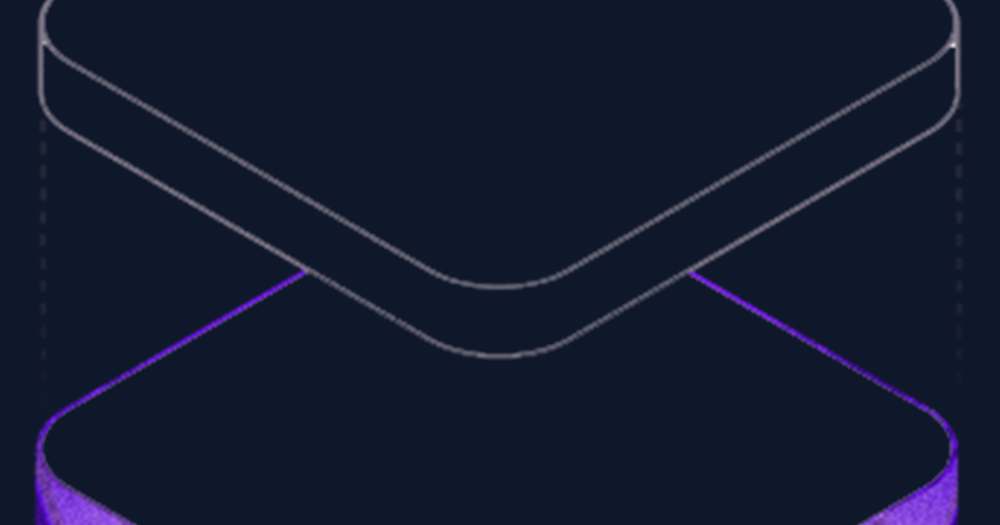

# KoalaShip

> Du kannst es dir gerade nicht leisten? Dann leiste es dir wenigstens hier.

KoalaShip is an open-source shopping and parcel-delivery simulation. It recreates
the enjoyable parts of online shopping: browsing products, comparing prices,
placing fictional orders, waiting for deliveries, unboxing purchases and
displaying them in a personal collection.

No real money, merchants or debt are involved. All KoalaCoins, products, prices,
orders and documents are fictional.

[Live demo](https://ship.koalastuff.net) ·
[Changelog](CHANGELOG.md) ·
[Contributing](CONTRIBUTING.md) ·
[MIT License](LICENSE)



## What You Can Do

- Create or randomize a local profile with a fictional career and salary
- Browse detailed products with variants, specifications and reviews
- Search, filter, sort and compare up to three products
- Observe transparent daily prices and a simulated 30-day price history
- Build a cart, apply discount codes and choose a delivery method
- Track fictional parcels through logistics stages and a live map
- Watch delivery windows, remaining stops and status updates
- Unpack delivered products through a short packaging sequence
- Download fictional invoices and delivery notes
- Create dream lists and savings goals
- Collect clothes, vehicles, electronics, furniture and curiosities
- Buy fictional properties and decorate their rooms
- Configure outfits, a vehicle garage and an electronics setup
- Read a context-aware satirical e-commerce news ticker
- Export and import the complete local game state
- Install KoalaShip as a progressive web app

## Design Principles

KoalaShip aims to simulate anticipation without copying the harmful parts of
real commerce.

- **No debt:** the balance can never become negative.
- **No dark patterns:** no fake countdowns or deliberately misleading scarcity.
- **No real purchases:** checkout never contacts a merchant or payment provider.
- **Local first:** profiles, orders and collections remain in the browser.
- **Optional location:** any fictional map point can be used as the delivery
  destination.
- **Simulation over chores:** progression comes from shopping and collecting,
  not daily tasks.

## Technology

- [Svelte 5](https://svelte.dev/)
- [TypeScript](https://www.typescriptlang.org/)
- [Vite](https://vite.dev/)
- [Tailwind CSS](https://tailwindcss.com/)
- [Leaflet](https://leafletjs.com/)
- Public [OSRM](https://project-osrm.org/) routing
- [CARTO](https://carto.com/) map tiles based on OpenStreetMap data

See [docs/ARCHITECTURE.md](docs/ARCHITECTURE.md) for the data model, persistence
strategy and application flow.

## Local Development

Requirements:

- Node.js 20 or newer
- npm

```bash
git clone https://github.com/Shik3i/KoalaShip.git
cd KoalaShip
npm ci
npm run dev
```

Vite prints the local development URL. Its development proxy maps:

- `/api/route/*` to the public OSRM routing service
- `/api/tiles/light/*` to CARTO light tiles
- `/api/tiles/dark/*` to CARTO dark tiles

### Developer Controls

Append `?dev=true` to the URL to expose delivery acceleration controls:

```text
http://localhost:5173/?dev=true
```

These controls are intentionally hidden from normal users.

## Verification

Run both checks before submitting changes:

```bash
npm run check
npm run build
```

`npm run check` runs Svelte diagnostics and TypeScript validation. The production
build is written to `dist/`, which is intentionally committed for the current
deployment workflow.

## Project Structure

```text
src/
  components/     Shared UI, notifications and the news ticker
  data/           Extendable JSON content such as satire headlines
  lib/            Store, routing, localization, sound and theme logic
  views/          Main application screens
public/           PWA, fonts, icons and social-preview assets
dist/             Committed production build
docs/             Architecture and maintenance documentation
```

To add satire headlines, edit
[`src/data/news-ticker.json`](src/data/news-ticker.json). Entries support a
category, selection weight and optional conditions such as an active cart or a
parcel being out for delivery.

## Privacy

KoalaShip has no account server or user database. The game state is stored in
`localStorage`.

Map tiles and routes are requested through same-origin reverse proxies. Route
calculation forwards the selected start and destination coordinates to OSRM.
Users do not need to select their real home address; any map point works.

The full German and English privacy text is available inside the application.

## Deployment

Create the production build:

```bash
npm ci
npm run build
```

Serve the contents of `dist/` as a single-page application. The production
deployment also requires same-origin routes for OSRM and CARTO. An example is
provided in [CADDYFILE.md](CADDYFILE.md).

The service worker must be served without immutable caching so new releases can
replace old application shells.

## Contributing

Bug reports, accessibility improvements, translations, products, satire
headlines and focused feature contributions are welcome. Please read
[CONTRIBUTING.md](CONTRIBUTING.md) before opening a pull request.

For security or privacy issues, follow [SECURITY.md](SECURITY.md).

## License

KoalaShip is licensed under the [MIT License](LICENSE).

Copyright (c) 2026 Timo (KoalaDev)
